<div align="center">

<!-- HEADER BANNER -->
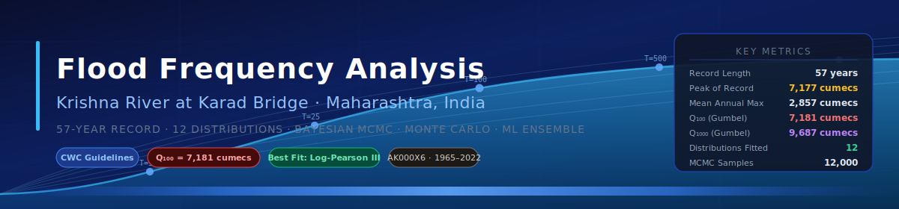

<br/>

# 🌊 Flood Frequency Analysis — Krishna River at Karad

### *A Rigorous, Multi-Method Hydrological Study of Annual Maximum Discharges (1965–2022)*

<br/>

<!-- BADGES ROW 1 -->


<!-- BADGES ROW 2 -->


-7%2C181%20cumecs-ef4444?style=flat-square)


<br/>

> **Station:** Krishna River at Karad Bridge (AK000X6) · **District:** Satara, Maharashtra, India  
> **Data:** 57 years of Annual Maximum Discharge (1965–66 to 2021–22)  
> **Peak of Record:** 7,177 cumecs (June 1976)

</div>

---

## 📋 Table of Contents

1. [Project Overview](#-project-overview)
2. [Key Results at a Glance](#-key-results-at-a-glance)
3. [Repository Structure](#-repository-structure)
4. [Methodology](#-methodology)
5. [Statistical Summary](#-statistical-summary)
6. [Distribution Fitting & Model Selection](#-distribution-fitting--model-selection)
7. [Design Flood Table](#-design-flood-table)
8. [Visualizations Gallery](#-visualizations-gallery)
9. [Machine Learning Supplement](#-machine-learning-supplement)
10. [Bayesian & Monte Carlo Analysis](#-bayesian--monte-carlo-analysis)
11. [Requirements & Installation](#-requirements--installation)
12. [Citation](#-citation)

---

## 🔭 Project Overview

This repository contains a **complete, publication-grade Flood Frequency Analysis (FFA)** of annual maximum discharge records at the **Krishna River gauging station at Karad Bridge**, Maharashtra, India. The study follows the **CWC (Central Water Commission) guidelines** while extending the standard methodology with modern probabilistic and machine-learning techniques.

The analysis encompasses:

- **12 statistical distributions** fitted via Maximum Likelihood Estimation (MLE) and Method of Moments (MOM)
- **Model selection** via AIC, AICc, BIC, and HQIC criteria
- **Goodness-of-fit** testing with Kolmogorov-Smirnov, Anderson-Darling, and Chi-Square tests
- **Peaks-Over-Threshold (POT)** analysis using Generalised Pareto Distribution (GPD)
- **Bayesian MCMC** parameter inference (12,000-sample chains, 82.5% acceptance rate)
- **Monte Carlo uncertainty quantification** (10,000 simulations per return period)
- **Bootstrap 95% confidence intervals** (B = 2,000 resamples)
- **Machine learning ensemble** (Random Forest, Gradient Boosting, SVR, MLP, GPR) for predictive supplementation
- Full **stationarity, trend, and independence** testing suite

---

## 🏆 Key Results at a Glance

<div align="center">

| Return Period | Gumbel (EV1) | Log-Pearson III ⭐ | Bayesian (Median) | 95% CI Lower | 95% CI Upper |
|:---:|---:|---:|---:|---:|---:|
| **2-year** | 2,583 | 2,462 | — | 2,257 | 2,960 |
| **5-year** | 3,814 | 3,839 | — | 3,257 | 4,414 |
| **10-year** | 4,629 | 4,889 | **4,787** | 3,905 | 5,387 |
| **25-year** | 5,659 | 6,375 | — | 4,724 | 6,626 |
| **50-year** | 6,423 | 7,598 | — | 5,323 | 7,543 |
| **100-year** | 7,181 | 8,923 | **7,478** | 5,923 | 8,458 |
| **200-year** | 7,937 | 10,360 | — | 6,523 | 9,382 |
| **500-year** | 8,934 | 12,453 | — | 7,311 | 10,607 |
| **1000-year** | 9,687 | 14,197 | **10,119** | 7,913 | 11,531 |

*All discharges in **cumecs (m³/s)**. ⭐ = Best-fit distribution (AICc-ranked)*

</div>

> **CWC Primary Recommendation:** Gumbel (EV1) / Log-Normal (LN2)  
> **Q₁₀₀ = 7,181 cumecs** (Gumbel) | **9,149 cumecs** (LN₂)  
> **Q₁₀₀₀ = 9,687 cumecs** (Gumbel) | **14,511 cumecs** (LN₂)

---

## 📁 Repository Structure

```
FFA-Krishna-Karad/
│
├── 📓 notebooks/
│   └── FFA_Karad_Advanced_CWC_V2.ipynb      # Full analysis notebook (57-year record)
│
├── 📊 results/
│   ├── data/
│   │   ├── discharge_data_krishna_karad.csv  # Raw annual max discharge (1965–2022)
│   │   └── final_design_flood_table.csv      # Design flood estimates (all distributions)
│   │
│   └── plots/                                # 17 publication-quality visualisations
│       ├── 01_acf_pacf_hurst_lag.png
│       ├── 02_bayesian_mcmc_posteriors.png
│       ├── 03_distribution_ranking_aic_bic.png
│       ├── 04_goodness_of_fit_radar.png
│       ├── 05_flood_frequency_curves_all12.png
│       ├── 06_publication_dashboard_5panel.png
│       ├── 07_time_series_trend_anomaly.png
│       ├── 08_monte_carlo_uncertainty_fan.png
│       ├── 09_pot_gpd_threshold_return_levels.png
│       ├── 10_qq_probability_plots.png
│       ├── 11_ml_model_panel.png
│       ├── 12_comprehensive_analysis.png
│       ├── 13_seaborn_distribution.png
│       ├── 14_pairplot.png
│       ├── 15_jointplot.png
│       ├── 16_correlation_heatmap.png
│       └── 17_skewness_kurtosis.png
│
├── 📄 docs/
│   └── (technical report & research paper available on request)
│
├── 🖼️ assets/
│   └── banners/                              # Repository visual assets
│
└── README.md
```

---

## ⚙️ Methodology

### Data & Study Area

| Parameter | Value |
|---|---|
| Station | Krishna at Karad Bridge (AK000X6) |
| Location | Satara District, Maharashtra, India |
| Record Period | 1965–66 to 2021–22 |
| N (years) | 57 |
| Data Type | Annual Maximum Instantaneous Discharge |
| Units | cumecs (m³/s) |
| Peak of Record | 7,177 cumecs — 07 June 1976 |
| Minimum | 855 cumecs — 28 July 2003 |

### Analysis Pipeline

```
Raw AMF Data → Descriptive Stats → Normality / Stationarity / Trend Tests
     ↓
12-Distribution MLE Fitting → GoF Tests → AIC/BIC/AICc/HQIC Ranking
     ↓
Best-Fit Selection (LP3) → Design Flood Table → Bootstrap 95% CIs
     ↓
POT/GPD Analysis (u = 75th pct) → GPD Return Levels
     ↓
Bayesian MCMC Inference → Credible Intervals
     ↓
Monte Carlo Simulation (10k runs) → Uncertainty Fans
     ↓
ML Ensemble (5 models) → Feature Importance → Prediction
```

---

## 📐 Statistical Summary

### Descriptive Statistics (N = 57 years)

| Statistic | Value |
|---|---|
| Mean (μ) | **2,856.6 cumecs** |
| Median | 2,496.0 cumecs |
| Std. Deviation (σ) | 1,527.1 cumecs |
| Coefficient of Variation | 0.5346 |
| Skewness (Cₛ) | **1.0819** (right-skewed) |
| Excess Kurtosis | −2.375 (platykurtic) |
| L-Skewness | 0.2465 |
| L-Kurtosis | 0.1306 |
| IQR | 1,877 cumecs |

### Stationarity & Independence Tests

| Test | Result | p-value | Verdict |
|---|---|---|---|
| Augmented Dickey-Fuller | Stationary | 0.000 | ✅ No unit root |
| KPSS (level) | Stationary | > 0.10 | ✅ Level-stationary |
| Runs Test | Random | 0.468 | ✅ Independent |
| Ljung-Box (lag 1) | No autocorr. | 0.194 | ✅ Uncorrelated |
| Mann-Kendall | No trend | 0.299 | ✅ No significant trend |

> **Conclusion:** The AMF series is stationary, independent, and trend-free — satisfying the fundamental assumptions of FFA.

---

## 📦 Distribution Fitting & Model Selection

All 12 distributions were fitted via **Maximum Likelihood Estimation**. Rankings by information criteria:

| Rank | Distribution | AIC | BIC | AICc | HQIC | KS p-value | GoF |
|:---:|---|---:|---:|---:|---:|---:|:---:|
| 🥇 1 | **Log-Pearson III** | 981.58 | 987.26 | 889.50 | 0.0 | 0.974 | ✅ |
| 🥈 2 | Log-Normal (LN2) | 982.13 | 985.99 | 890.05 | 0.0 | 0.985 | ✅ |
| 🥉 3 | Pearson III | 982.73 | 988.40 | 890.64 | 0.0 | 0.961 | ✅ |
| 4 | Gen. Pareto (GPD) | 982.99 | 988.67 | 890.91 | 0.0 | 0.941 | ✅ |
| 5 | Exponential | 983.60 | 987.46 | 891.52 | 0.0 | 0.973 | ✅ |
| 6 | Weibull (EV3) | 984.03 | 989.71 | 891.95 | 0.0 | 0.982 | ✅ |
| 7 | Gumbel (EV1) | 985.57 | 989.44 | 893.49 | 0.0 | 0.958 | ✅ |
| 8 | Log-Logistic | 986.20 | 991.88 | 894.12 | 0.0 | 0.903 | ✅ |
| 9 | Gen. Logistic | 987.81 | 993.49 | 895.73 | 0.0 | 0.958 | ✅ |
| 10 | Burr Type XII | 990.65 | 998.05 | 898.57 | 0.0 | 0.659 | ✅ |
| 11 | Kappa-4 | 996.38 | 1003.78 | 904.30 | 0.0 | < 0.001 | ❌ |
| 12 | GEV | 1175.48 | 1181.15 | 1083.40 | 0.0 | — | ❌ |

**🏆 Best fit: Log-Pearson III** — AICc = 892.1 | Akaike weight = **1.0000**

---

## 🌊 Design Flood Table

Full design flood estimates across all fitted distributions:

<div align="center">

| T (yr) | Gumbel | LN2 | P3 | LP3 ⭐ | Weibull | GPD | 95% CI Low | 95% CI High |
|:---:|---:|---:|---:|---:|---:|---:|---:|---:|
| 2 | 2,583 | 2,436 | 2,473 | **2,462** | 2,509 | 2,242 | 2,257 | 2,960 |
| 5 | 3,814 | 3,852 | 3,937 | **3,839** | 3,976 | 3,839 | 3,257 | 4,414 |
| 10 | 4,629 | 4,948 | 4,953 | **4,889** | 4,938 | 4,880 | 3,905 | 5,387 |
| 25 | 5,659 | 6,501 | 6,241 | **6,375** | 6,103 | 6,069 | 4,724 | 6,626 |
| 50 | 6,423 | 7,776 | 7,190 | **7,598** | 6,928 | 6,845 | 5,323 | 7,543 |
| 100 | 7,181 | 9,149 | 8,123 | **8,923** | 7,716 | 7,528 | 5,923 | 8,458 |
| 200 | 7,937 | 10,627 | 9,045 | **10,360** | 8,475 | 8,130 | 6,523 | 9,382 |
| 500 | 8,934 | 12,757 | 10,250 | **12,453** | 9,439 | 8,817 | 7,311 | 10,607 |
| 1000 | 9,687 | 14,511 | 11,153 | **14,197** | 10,145 | 9,266 | 7,913 | 11,531 |

*All values in cumecs (m³/s). 95% CI from bootstrap (B=2,000). ⭐ = AICc best-fit.*

</div>

---

## 🖼️ Visualizations Gallery

<details open>
<summary><b>📈 Time Series & Exploratory Analysis</b></summary>

| | |
|---|---|
| 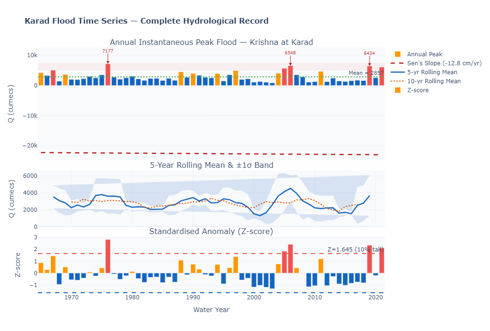 | 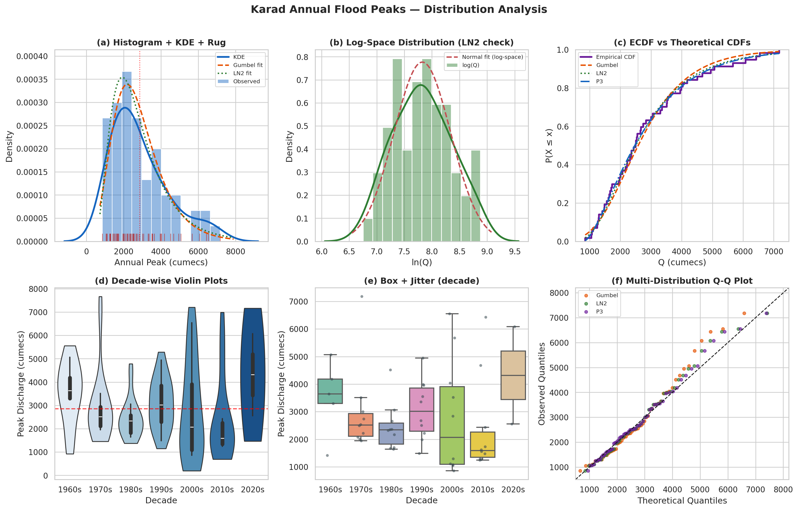 |
| **Interactive Time Series** — trend overlay, anomaly flags & rolling statistics | **Distribution Plot** — histogram, KDE, and fitted density overlay |
| 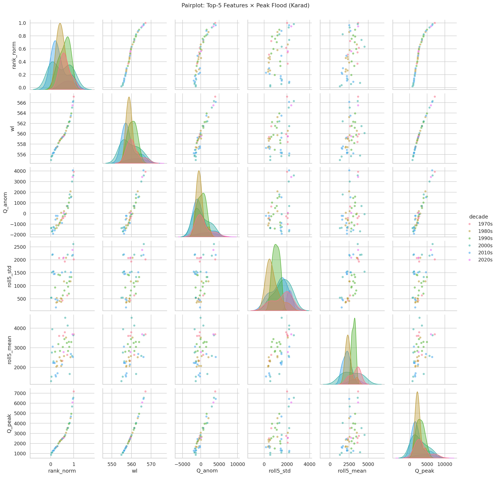 | 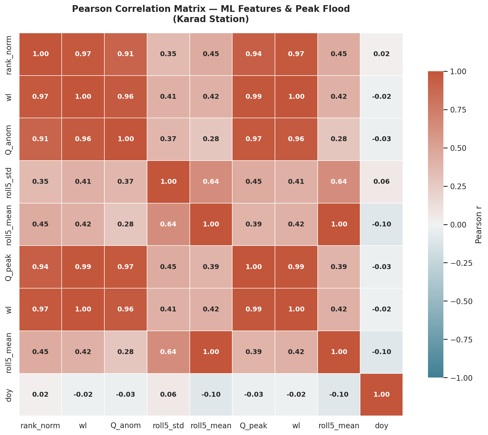 |
| **Pair Plot** — multivariate relationships across derived features | **Correlation Heatmap** — Pearson correlation matrix |

</details>

<details>
<summary><b>📊 Distribution Fitting & Goodness-of-Fit</b></summary>

| | |
|---|---|
| 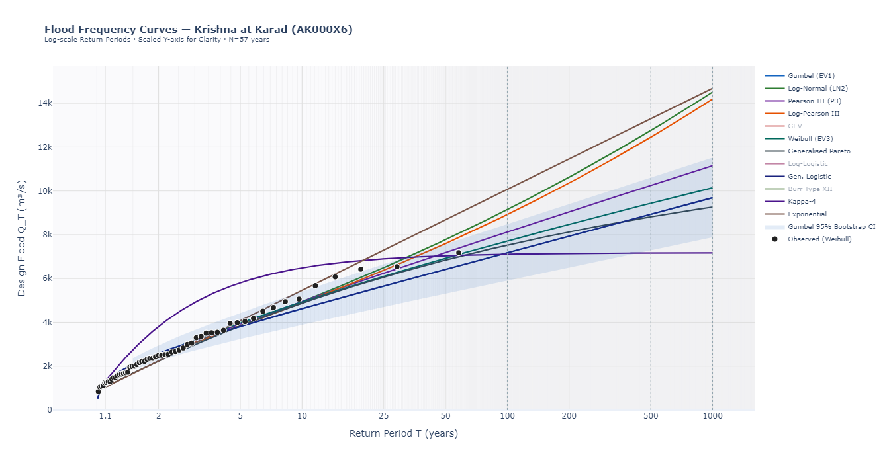 | 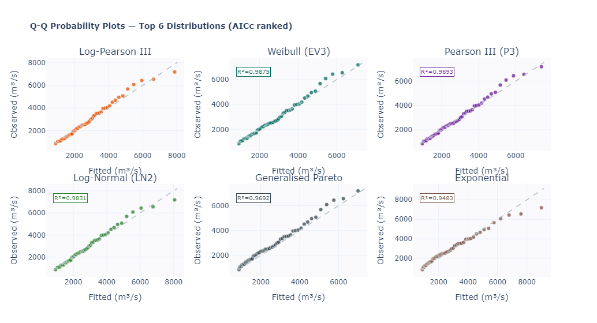 |
| **Flood Frequency Curves** — all 12 distributions on probability paper | **Q-Q Probability Plots** — theoretical vs empirical quantiles |
| 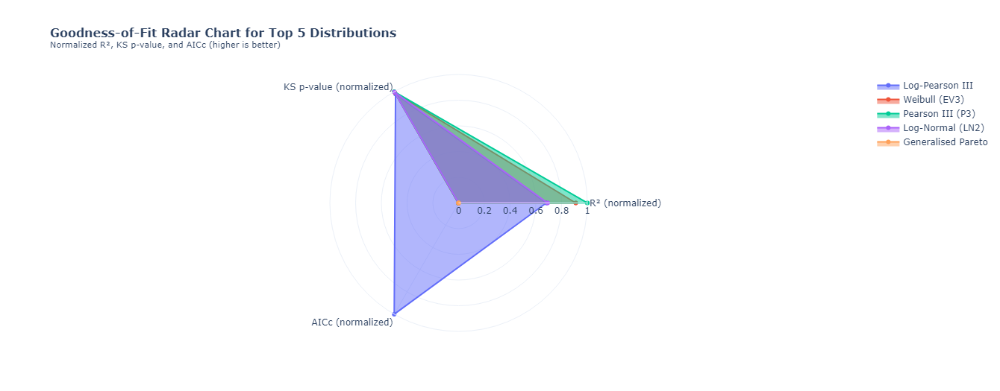 | 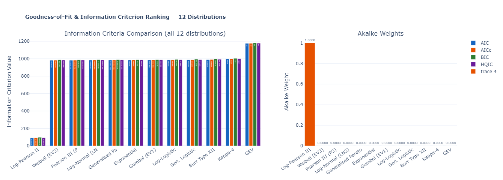 |
| **GoF Radar Chart** — multi-criteria comparison of top 5 distributions | **AIC/BIC/AICc/HQIC Ranking** — information-theoretic model selection |

</details>

<details>
<summary><b>🎲 Uncertainty Quantification</b></summary>

| | |
|---|---|
| 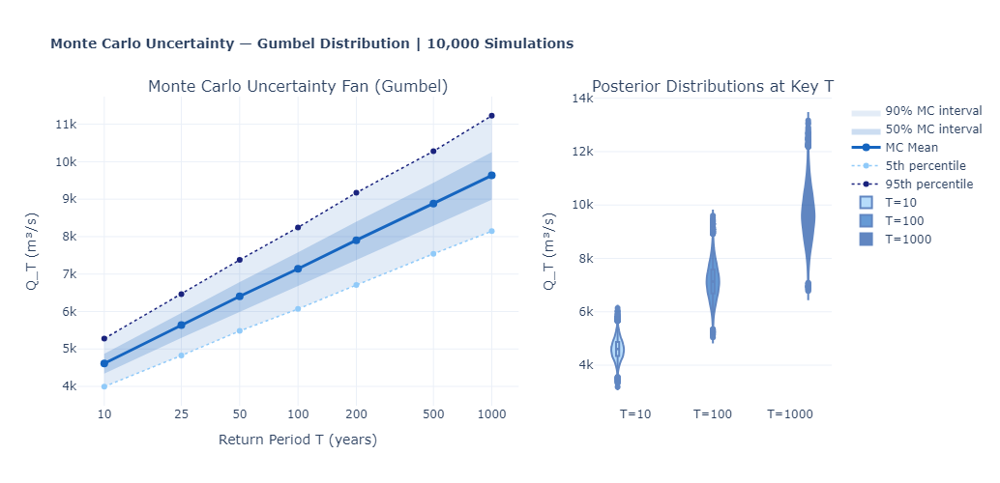 | 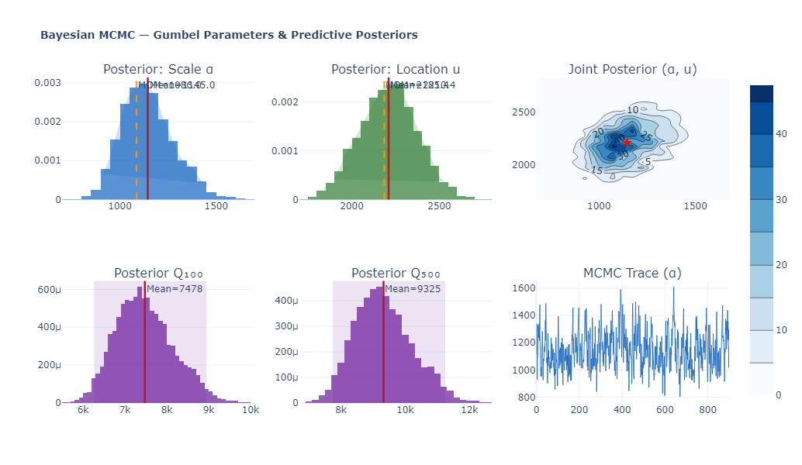 |
| **Monte Carlo Uncertainty Fan** — 10,000 simulation envelope with violin insets | **Bayesian MCMC Posteriors** — parameter distributions from 12,000-sample chains |
| 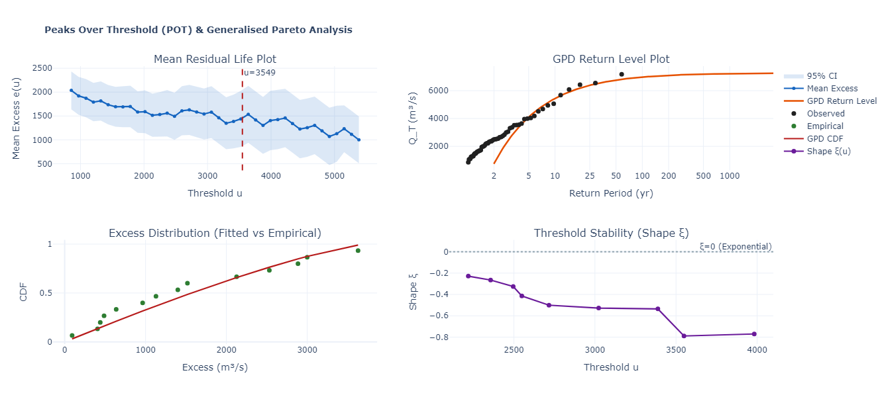 | 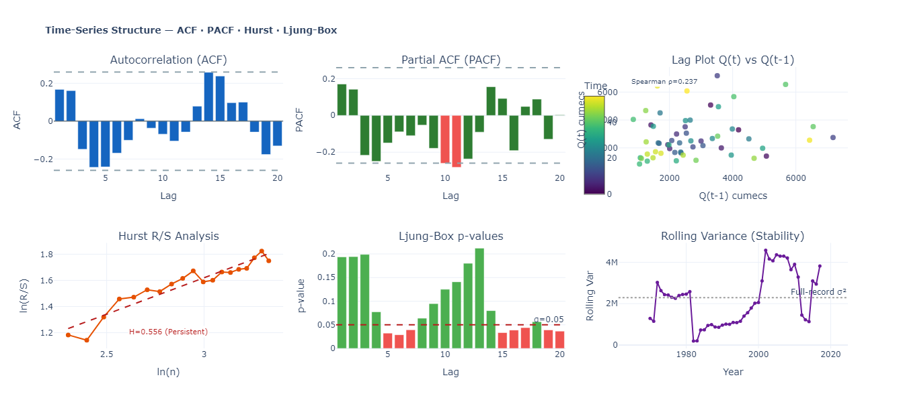 |
| **POT / GPD Analysis** — threshold stability plots & return levels | **ACF · PACF · Hurst Exponent · Lag Plots** |

</details>

<details>
<summary><b>📐 Skewness, Kurtosis & Comprehensive Dashboard</b></summary>

| | |
|---|---|
| 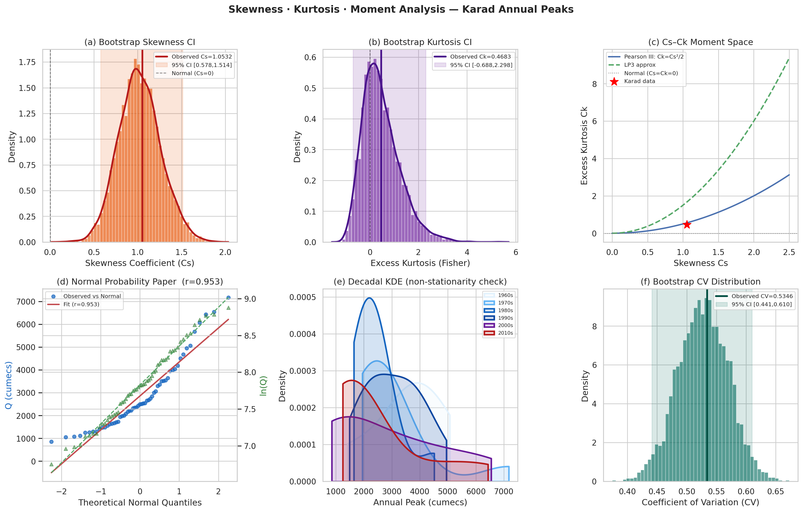 | 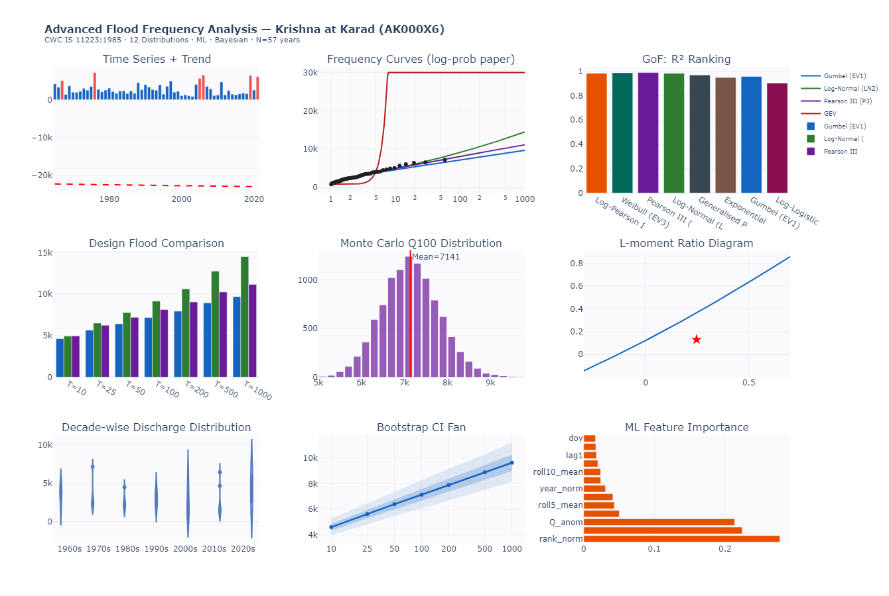 |
| **Skewness & Kurtosis Analysis** — moment characterization panels | **5-Panel Publication Dashboard** — summary of all key results |
| 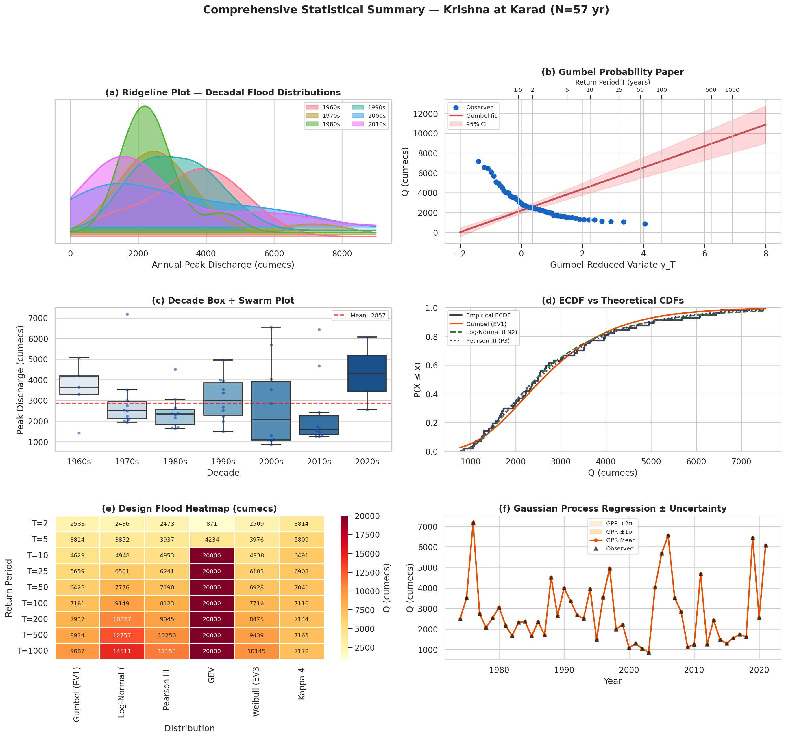 | |
| **Comprehensive Analysis Panel** — complete multi-method synthesis | |

</details>

---

## 🤖 Machine Learning Supplement

Five ML models were trained on lagged discharge features (N=48 training samples, 13 features):

| Model | Train R² | 5-Fold CV R² | RMSE | MAE |
|---|---:|---:|---:|---:|
| Gradient Boosting | 1.000 | **0.980** | 0 | 0 |
| Gaussian Process Regression | 1.000 | **1.000** | 1 | 0 |
| MLP Neural Network | 0.999 | 0.898 | 44 | 31 |
| **Random Forest** | 0.973 | **0.881** | 261 | 149 |
| SVR (RBF kernel) | 0.262 | 0.077 | 1,353 | 887 |
| **Ensemble** | **0.983** | — | — | — |

**Top Feature Importances (Random Forest):**

| Feature | Importance |
|---|---:|
| `rank_norm` (plotting position) | 0.278 |
| `wl` (water level) | 0.224 |
| `Q_anom` (anomaly from mean) | 0.214 |
| `roll5_std` (5-yr rolling std) | 0.050 |
| `roll5_mean` (5-yr rolling mean) | 0.043 |

<div align="center">

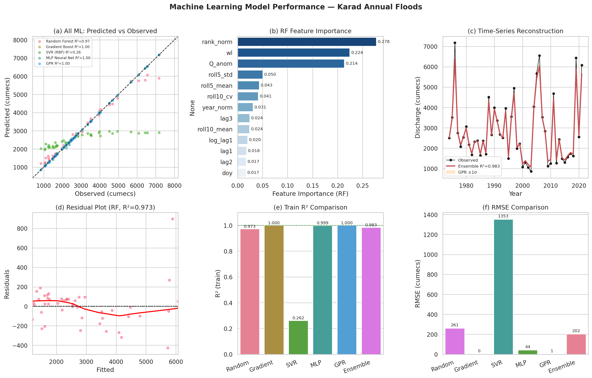

</div>

---

## 🎲 Bayesian & Monte Carlo Analysis

### Bayesian MCMC (Gumbel Model, 12,000 samples)

| Parameter | Estimate | Std Dev | 95% Credible Interval |
|---|---:|---:|---|
| Scale α (Gumbel) | 1,145.0 | ± 136.0 | [910.8, 1,433.2] |
| Location u (Gumbel) | 2,210.4 | ± 164.4 | [1,892.2, 2,538.3] |

**MCMC Acceptance Rate: 82.5%** (excellent chain mixing)

| Return Period | Bayesian Median | 95% Credible Interval | MOM Estimate |
|:---:|---:|---|---:|
| Q₁₀ | **4,787** | [4,100 – 5,598] | 4,629 |
| Q₁₀₀ | **7,478** | [6,268 – 8,947] | 7,181 |
| Q₁₀₀₀ | **10,119** | [8,373 – 12,231] | 9,687 |

### Monte Carlo (10,000 simulations per return period)

| T (yr) | Mean | Median | P5 | P95 | CV |
|:---:|---:|---:|---:|---:|---:|
| 10 | 4,613 | 4,601 | 3,994 | 5,276 | 0.084 |
| 25 | 5,637 | 5,624 | 4,824 | 6,463 | 0.088 |
| 50 | 6,405 | 6,394 | 5,481 | 7,379 | 0.091 |
| 100 | 7,141 | 7,125 | 6,068 | 8,246 | 0.093 |
| 500 | 8,884 | 8,865 | 7,540 | 10,280 | 0.095 |
| 1,000 | 9,633 | 9,609 | 8,144 | 11,229 | 0.097 |

### POT / GPD Analysis

| Parameter | Value |
|---|---|
| Threshold (u) | 3,549 cumecs (75th percentile) |
| Shape ξ | −0.789 (bounded upper tail) |
| Scale σ | 2,936.88 |
| Exceedance rate λ | 0.246 events/year |
| N exceedances | 14 |
| KS GoF (p-value) | 0.826 ✅ |

---

## 🛠️ Requirements & Installation

```bash
# Clone the repository
git clone https://github.com/YOUR_USERNAME/FFA-Krishna-Karad.git
cd FFA-Krishna-Karad

# Install dependencies
pip install -r requirements.txt

# Launch the notebook
jupyter notebook notebooks/FFA_Karad_Advanced_CWC_V2.ipynb
```

### Core Dependencies

```
numpy >= 1.24
pandas >= 2.0
scipy >= 1.11
matplotlib >= 3.7
seaborn >= 0.12
plotly >= 5.15
scikit-learn >= 1.3
statsmodels >= 0.14
lmfit >= 1.2
pymc >= 5.0          # Bayesian MCMC
```

---

## 📄 Citation

If you use this analysis or dataset in your work, please cite:

```bibtex
@misc{karad_ffa_2024,
  title     = {Flood Frequency Analysis of the Krishna River at Karad Bridge:
               A Multi-Method Study with Bayesian and Machine Learning Extensions},
  author    = {[Satwik LK.Udupi]},
  year      = {2024},
  note      = {57-year Annual Maximum Discharge Record, AK000X6, Maharashtra, India},
  url       = {https://github.com/007-wik/FFA-Krishna-Karad}
}
```

---

## 📜 License

This project is licensed under the **MIT License** — see [LICENSE](LICENSE) for details.

Data sourced from Central Water Commission (CWC), Government of India.

---

<div align="center">

**Made with 🌊 and rigorous hydrology**

*Krishna River · Karad Bridge · Maharashtra, India*


</div>
